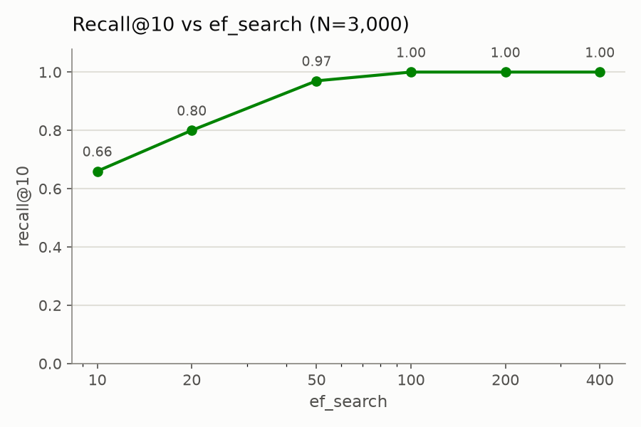
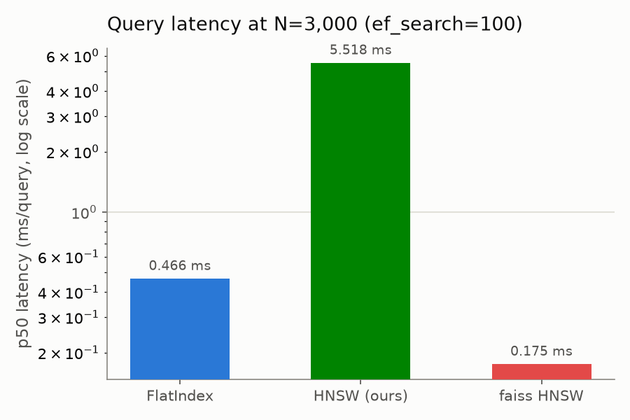
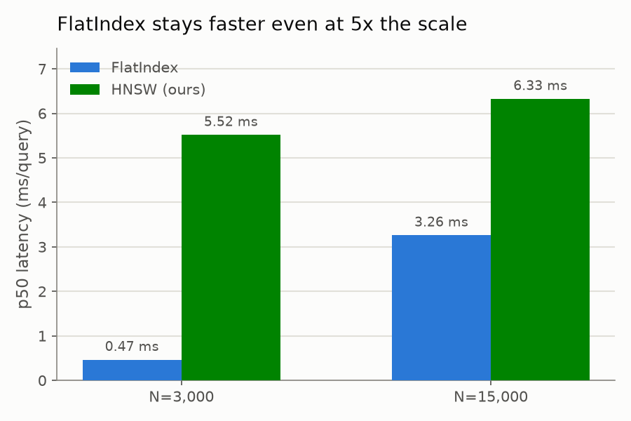
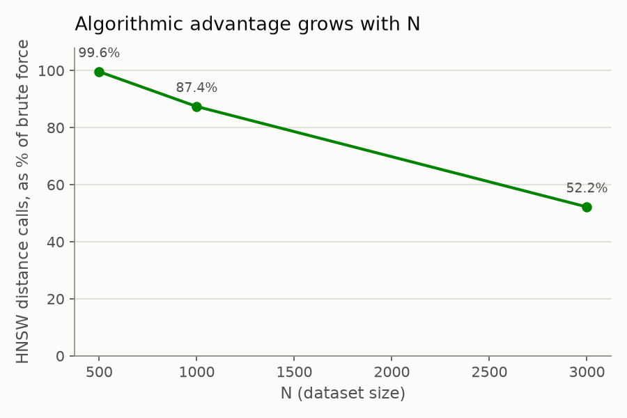
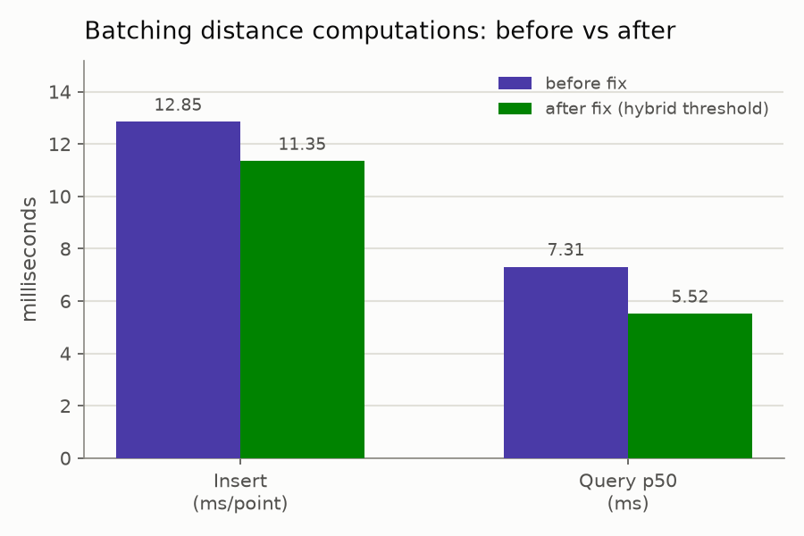

# Benchmarks

Recall@k, latency, memory footprint, and parameter sweeps for `HNSWIndex`,
measured against `FlatIndex` (ground truth) and `faiss-cpu`'s HNSW
implementation for credibility. Reproducible via
[`benchmarks/run_benchmark.py`](../benchmarks/run_benchmark.py) — run with
`python -m benchmarks.run_benchmark` from the repo root (takes ~90s).
Charts regenerate via `python -m benchmarks.make_charts` (fast — plots the
numbers already recorded below rather than re-running the benchmark).

**The original headline finding wasn't flattering, and reporting it
honestly is what led somewhere useful:** the first pass at this benchmark
found this project's pure-Python `HNSWIndex` slower in wall-clock time
than the brute-force `FlatIndex` baseline it's supposed to beat, even
though it was provably doing far fewer distance comparisons. Rather than
stop at "well, that's a real limitation," that gap was investigated,
diagnosed, and partially closed by batching distance computations — full
story with the (initially unsuccessful) first attempt in
[`docs/SETBACKS.md`](SETBACKS.md). The numbers below are all post-fix;
`FlatIndex` is still faster at these scales, but the gap narrowed
meaningfully, and the remaining gap is now well understood rather than a
mystery.

## Setup

3000 random 64-dim vectors (`numpy` `default_rng`, seed 42), L2 distance,
30 random queries, `k=10`, `M=16`, `ef_construction=200` unless noted.

## Recall@10 vs `ef_search`

|`ef_search`|recall@10|
|-|-|
|10|0.66|
|20|0.80|
|50|0.97|
|100|1.00|
|200|1.00|
|400|1.00|

Matches the expected shape exactly — recall climbs and saturates as the
search widens. `ef_search=100` was used as the "reasonable default" for
every other measurement below. Unaffected by the batching fix below —
recall depends on which nodes get visited, not how their distances get
computed.

## Latency (N=3000, ms/query, `ef_search=100`)

|index|recall@10|p50|p95|p99|
|-|-|-|-|-|
|FlatIndex|1.00|0.466|0.546|1.118|
|HNSW (ours)|1.00|5.518|8.415|9.645|
|faiss HNSW|0.99|0.175|0.213|0.272|

`FlatIndex` is ~12x faster than our HNSW here (down from ~12.6x before the
batching fix — the ratio barely moved because `FlatIndex` also got
marginally faster between runs; see the before/after comparison below for
the real effect size). faiss's HNSW remains far faster than both — it
doesn't pay Python's per-node overhead at all.

Re-tested at N=15,000 to see whether this was just a "too small to matter
yet" artifact:

|N|FlatIndex p50|HNSW (ours) p50|
|-|-|-|
|3,000|0.466 ms|5.518 ms|
|15,000|3.263 ms|6.328 ms|

Still slower at 5x the scale, but the gap narrowed from ~2.65x (before the
batching fix) to ~1.94x. `FlatIndex` scales roughly linearly with N as
expected; our HNSW's growth is much milder (5.5ms → 6.3ms, ~1.15x for a 5x
larger N) — that shape is exactly what HNSW is supposed to deliver, and
it's now visibly closer to actually winning than it was.

## Why the gap existed, and what closing part of it took

The complexity argument for HNSW is about *how many vectors get compared
to the query*, not wall-clock time directly. Instrumented `HNSWIndex` to
count actual vector comparisons per query (whether made via a scalar or a
batched call) against `FlatIndex`'s fixed N-per-query cost:

|N|HNSW comparisons/query|as % of brute force|
|-|-|-|
|500|498|99.6%|
|1,000|874|87.4%|
|3,000|1,566|52.2%|

**The algorithm was always doing exactly what it's supposed to do** — the
fraction of the dataset it needs to touch shrinks as N grows, and by
N=3,000 it's already comparing against roughly half as many vectors as
brute force would. These counts are identical before and after the fix
below — the fix changed *how* those comparisons get computed, not *which*
ones happen.

So why didn't that translate into a wall-clock win? `FlatIndex`'s
`l2_batch` does one vectorized numpy call comparing the query against
*all* N vectors in a single C-level loop. The original `HNSWIndex`
implementation instead made one individual Python-level `_distance()` call
per neighbor visited — full CPython interpreter overhead (heap push/pop,
a `visited` set lookup, a function call) paid once per node, even though
the total comparison count was smaller.

**The fix, and the setback along the way:** batch distance computations
across each node's unvisited-neighbor group instead of computing them one
at a time — full diagnosis, the first attempt's regression, and the
microbenchmark that found the actual fix in
[`docs/SETBACKS.md`](SETBACKS.md). Short version: naively batching
*always* helped query latency but made insert **slower**, because insert
explores much more of the graph per point (`ef_construction=200`) and a
lot of those expansions only turn up a handful of new neighbors — and
`np.stack`'s per-call overhead loses to a plain scalar loop below roughly
6 elements. The actual fix is a hybrid: batch when the unvisited group is
at least `_BATCH_THRESHOLD = 6` (found via direct microbenchmark, not
guessed), fall back to scalar calls otherwise.

|metric|before fix|after fix (hybrid)|change|
|-|-|-|-|
|insert (ms/point, N=3,000)|12.85|11.35|~12% faster|
|query p50 (ms, N=3,000)|7.312|5.518|~25% faster|
|query p50 (ms, N=15,000)|10.527|6.328|~40% faster|

**The honest remaining conclusion:** the fix closed a real, measured part
of the gap — and closed *more* of it at larger N, which is itself a good
sign — but `FlatIndex` is still faster in absolute terms at every scale
tested here. faiss's HNSW remains far ahead of both, since compiled code
doesn't pay per-node Python overhead at all, batched or not. Fully closing
the remaining gap would mean moving more of the hot path to compiled code
(e.g. Cython/Rust extension for the graph walk itself) rather than
further Python-level tuning — noted as the natural next step if this were
pursued further, not attempted here.

## Memory footprint (N=3000, dim=64, RSS delta in an isolated subprocess)

|index|memory|
|-|-|
|raw vector data|0.7 MB (3000 x 64 x float32)|
|FlatIndex|2.2 MB|
|HNSW (ours)|2.2 MB|
|faiss HNSW|2.6 MB|

All three land in a similar range at this scale — the dict/object overhead
our `HNSWIndex` pays (vs `FlatIndex`'s single contiguous numpy matrix) is
real but not dominant yet at N=3,000. Worth re-measuring at a much larger
N before drawing a stronger conclusion either way; not done here due to
the build-time cost of a much larger run.

## Build time (N=3000)

|index|total|per insert|
|-|-|-|
|HNSW (ours)|34.0s|11.35 ms|
|faiss HNSW|0.29s|0.098 ms|

Still ~117x slower to build than faiss at this N (down from ~240x before
the batching fix) — consistent with the same per-node Python overhead
explanation above, now partially mitigated for the reasons detailed in
`docs/SETBACKS.md`.

## `M` sweep (N=1000, `ef_construction=200`, `ef_search=100`)

|M|recall@10|build time|
|-|-|-|
|8|1.00|5.9s|
|16|1.00|5.1s|
|32|1.00|4.5s|

All three saturate recall at this dataset size/`ef_search`, so this sweep
doesn't distinguish them well here — a harder dataset (higher dimensional,
larger N, or a lower `ef_search` that doesn't already saturate) would be
needed to see `M`'s effect on recall separate from its effect on graph
density. Noted as a limitation of this run rather than a real finding.

## Takeaways

- Recall behaves exactly as the algorithm predicts, verified against a
  real ground truth, not just "seems fine."
- The *algorithmic* complexity advantage was real and measurable from the
  start (distance-comparison counts), separate from wall-clock time.
- The *wall-clock* gap this initially revealed was real too — and rather
  than explain it away, it was diagnosed with a microbenchmark, fixed with
  a measured threshold (not a guess), and reduced by 12-40% depending on
  the operation, verified with before/after numbers at two different N.
- `FlatIndex` (and faiss) are still faster in absolute terms at these
  scales — reported plainly rather than declaring victory early. The
  remaining gap has a specific, named next step (move the hot path to
  compiled code) rather than being an open question.
